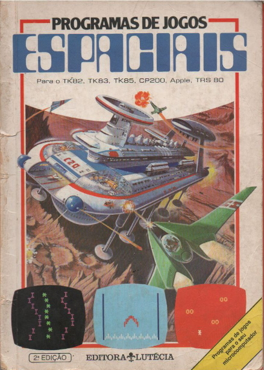
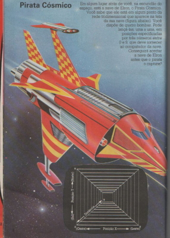
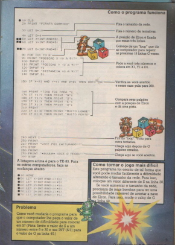

#  Pirata Cósmico
Jogo Console retirado do livro Programas de Jogos Espaciais, que ganhei do meu falecido Tio Rogério.
Jogo é simples e feito em Basic e foi portado para java



### Java
Feito em Java OpenJDK 11

#### Páginas do Livro
 

### Clonar respositório :
```bash
git clone https://github.com/selrahcsan/PirataCosmico  
```
### Executar:
```bash
cd /PirataCosmico/src/main/java/org/example/
java Main.java
```